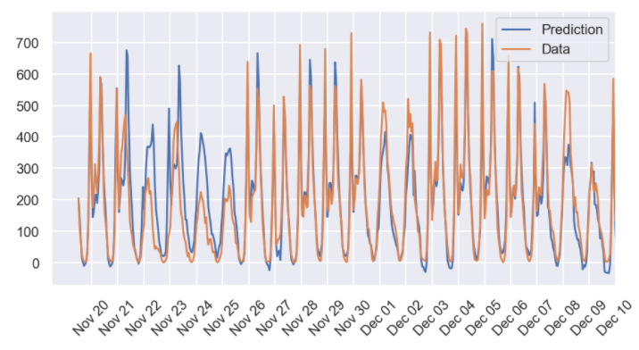
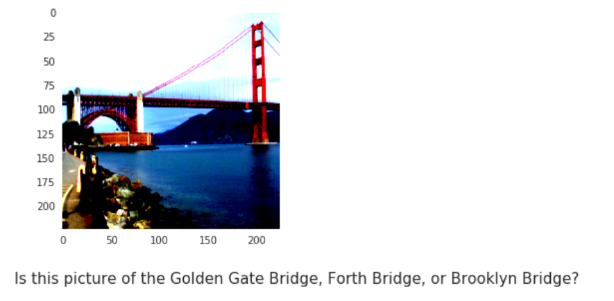
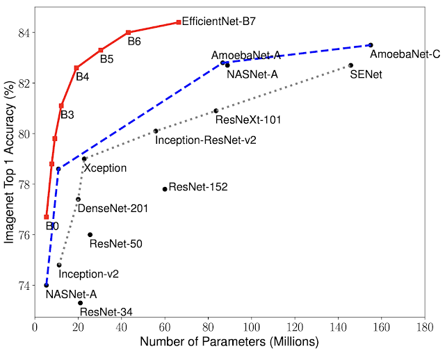
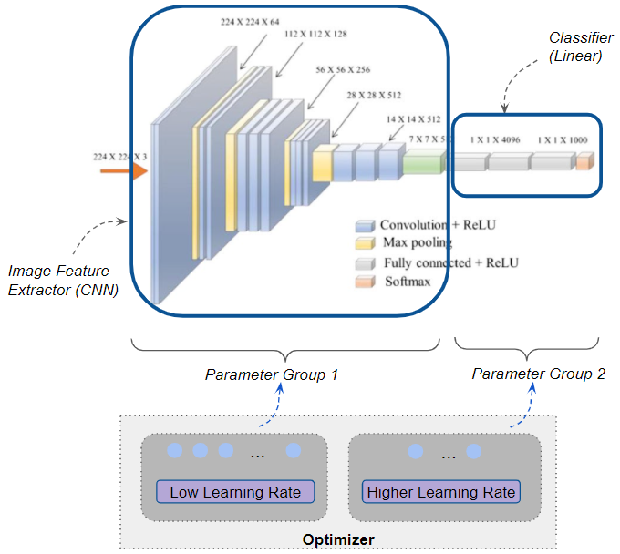

# Udacity Deep Learning Nanodegree Program + Own Projects
This folder contains all the projects from Udacity's Nanodegree Program along with own projects. The major projects are stored in the 'project-XXX' format or below:

The following projects are presented:  
**Udacity**
* Bike-Sharing (pure numpy)
* Landmark Classification (CNN, Transfer Learning, VGG16)
* TV Script Generator (RNN, LSTM)
* Face Generator (GAN, CycleGAN)
* Deploying a Sentiment Analysis Model (AWS SageMaker)

**Own**
* 102 Flowers (CNN, Transfer Learning, ResNet34, Discriminative Learning Rates)
* Bike-Sharing (CNN, Regression)
* Dog Classification (CNN, Transfer Learning)
* Cancer Detection (CNN, Transfer Learning)

## Bike-Sharing Rentals 
* <a href="https://github.com/issagaliyeva/udacity_deep_learning/blob/master/project-bike-sharing/Predicting_bike_sharing_data.ipynb">Numpy Implementation</a>
* <a href="https://github.com/issagaliyeva/udacity_deep_learning/blob/master/project-bike-sharing/pytorch_implementation.ipynb">Pytorch Implementation</a> [under development]

<b>The first</b> case was implemented using a vanilla approach with pure numpy package.  
<b>The second one</b>, however, is my implementation to see how the results differ using PyTorch.  

<b>Project Description</b>
* hour.csv : bike sharing counts aggregated on hourly basis. Records: 17379 hours
* day.csv - bike sharing counts aggregated on daily basis. Records: 731 days

Bike sharing systems are new generation of traditional bike rentals where whole process from membership, rental and return 
has become automatic. Through these systems, user is able to easily rent a bike from a particular position and return 
back at another position. Currently, there are about over 500 bike-sharing programs around the world which is composed of 
over 500 thousands bicycles. Today, there exists great interest in these systems due to their important role in traffic, 
environmental and health issues. 

Apart from interesting real world applications of bike sharing systems, the characteristics of data being generated by
these systems make them attractive for the research. Opposed to other transport services such as bus or subway, the duration
of travel, departure and arrival position is explicitly recorded in these systems. This feature turns bike sharing system into
a virtual sensor network that can be used for sensing mobility in the city. Hence, it is expected that most of important
events in the city could be detected via monitoring these data.

### Results
  
The objective of the project was to predict the bike rentals within the last month (December) of the second year.
It managed to achieve 0.062 on training set and 0.133 on test set. However, we can see that the December's results are overshooting.
The majority of people use bikes for work commutes. As we can see, the data we're testing the results on the last days of December. As we saw above, there is an over-prediction in the last days of December. 
We see such a phenomenon due to the fact that the Neural Network has seen one-year record (since we're withholding the last year for testing purposes). It could not generalize because of the holiday season. The solution to which would be to include more data on consecutive years.

### What I learnt
* Output layer doesn't need an activation function.  
It was surprising to learn that I don't need an activation function on the output layer since we were not dealing with classifications. It took me a lot of time 
to understand why the predictions were not going up and down but flat instead. 
* Unit test  
Before getting into the predictions themselves, I needed to pass unit tests to see if my architecture was built correctly. Instead of skipping the lines of code that
were created for us, I decided to break down the whole thing to see how everything works under the hood.   

---

## Landmark Classifier
* <a href="https://github.com/issagaliyeva/udacity_deep_learning/tree/master/project-landmark-classifier">VGG16 Model</a>
* <a>Other Models</a> [under development]

This project is subset of <a href='https://www.kaggle.com/google/google-landmarks-dataset'>Google Landmarks</a> dataset on Kaggle. The objective of this project was to build own and transfer architectures using Convolutional Neural Networks (CNN).

<b>Project Description</b>
* 5000 images (50 folders, 100 images in each)
* Datasets can be found here: [landmark dataset](https://udacity-dlnfd.s3-us-west-1.amazonaws.com/datasets/landmark_images.zip)

Photo sharing and photo storage services like to have location data for each photo that is uploaded. With the location data, these services can build advanced features, such as automatic suggestion of relevant tags or automatic photo organization, which help provide a compelling user experience. Although a photo's location can often be obtained by looking at the photo's metadata, many photos uploaded to these services will not have location metadata available. This can happen when, for example, the camera capturing the picture does not have GPS or if a photo's metadata is scrubbed due to privacy concerns.

If no location metadata for an image is available, one way to infer the location is to detect and classify a discernible landmark in the image. Given the large number of landmarks across the world and the immense volume of images that are uploaded to photo sharing services, using human judgement to classify these landmarks would not be feasible.

### Results
  
After going through dozens of research papers on Convolutional Neural Networks, I found the optimal architecture that managed to 
score 41% instead of the passing score of 20%. After reading <a href="https://arxiv.org/abs/1409.4842">Going Deeper with Convolutions</a>, I've decided to
go with 5-layer convolutions (each followed by ReLU activation function and max pooling) and 3 fully-connected layers. The interesting
part is that having 4 convolutional layers had 24% on the test data. By adding one more layer, its accuracy jumped by 17%! 

However, using VGG-16 for pre-trained model, scored a bit more than 70%. Not only did it score moderately, but also over 20 million parameters. 
This finding led me to reconsider my choice and find more optimal models. The experimentation will be covered in the next notebook. 

### What I learnt
* split-folders package
Until I got introduced to this package, I used the manual shuffling, splitting and indexing to divide the values into three categories:
training, validation, and testing sets. However, it was a tedious and long process. After my first submission, the reviewer
suggested looking at this module.
* Preprocessing pipeline
It took me forever to understand the importance of the transformations' sequence: place the ToTensor() before normalization! At the early stages,
I didn't follow that structure, and, of course, the code wasn't working. Also, it's important to perform the same transformations
to the validation and test sets. I was sure that we couldn't alter the test set only.
* Reshaping the values before the first fully-connected layer  
It's essential to flatten the values before passing them to fully-connected layers! Otherwise, it won't work.
* torchsummary package
When building the architecture, we need to make sure that each layer is correctly instantiated. To double-check the 
correctness, we need to use torchsummary!   

---

## TV Script Generator

---
## Face Generator

---
## Deploying the Model

---

## 102 Flower Classifier  
<a href="https://www.robots.ox.ac.uk/~vgg/publications/papers/nilsback08.pdf">Official Paper</a>&emsp;<a href="https://www.robots.ox.ac.uk/~vgg/data/flowers/102/">Official Page</a>&emsp;<a href="https://s3.amazonaws.com/fast-ai-imageclas/oxford-102-flowers.tgz">Download Dataset</a>&emsp;<a href="https://gist.github.com/JosephKJ/94c7728ed1a8e0cd87fe6a029769cde1">Download Labels</a>
 

<b>Project Description</b>
* train.csv : 1020 flower images' paths and targets (10 instances per category)
* validation.csv: 1020 flower images' paths and targets (10 instances per category)  
* test.csv: 6149 flower images' paths and targets

Although the idea of Deep Learning was born almost 80 years ago, we are just given the opportunity to bring any 
sophisticated ideas to life. That is why we will be looking 
at the extensively researched case of classfying 
<a href="https://www.robots.ox.ac.uk/~vgg/publications/papers/nilsback08.pdf">102 categories of flowers</a>. 
Even though the task does not sound hard, the challenges arise in the similarity in both color and shape.

  
To give an example of similarities, there are nine types of lilies (Giant White Arum, Fire, Water, Toad, Blackberry, 
Sword, Tiger, Peruvian, Canna) and two types of 
irises (Bearded and Yellow). Additional difficulties can be found with the non-conventional distribution of training 
(12.45%), validation (12.45%), and testing (75.1%) sets.
The project will be worked with <a href="https://arxiv.org/abs/1512.03385">ResNet34</a> pre-trained model (a residual 
network that was trained on ImageNet's images).
It is considerately smaller than most of the other models with only 20 million parameters. Thus, the training part 
will not take long even on CPU mode (from my findings, running 15 epochs takes around 40 minutes). 

### Results
The notebook contains experimentations with different model instantiations, in particular, various optimizers. 
There are three of them used: <a href="https://paperswithcode.com/method/sgd">Stochastic Gradient Descent</a> (<a href="https://arxiv.org/abs/1607.01981">Nesterov's Accelerated Gradients</a>), <a href="https://paperswithcode.com/method/adagrad">Adagrad</a> and <a href="https://paperswithcode.com/method/adam">Adam </a>. It's challenging to find the correct optimizers,  so I wanted to see the actual differences in prediction before settling with a specific one. In addition to these experimentations, fellowship.ai's requirement was to use Discriminative Learning Rates. Thus, all models were trained using that technique along with Exponential Learning Decay Scheduler to boost accuracy. 

The overall accuracy of each model is over 80%, with the best ones (SGD and Adam) scoring 87%. However, there is the fifth model that has more transformations, which had a 100%
confidence on classifying the never-seen-before image of a sunflower. 

### What I learnt
* os package  
I was manually transferring the images to satisfy DataLoader's and ImageFolder's requirements. Therefore, there was an extensive usage of such package. 
The main feature to remember: **DataLoader treats names as strings, even if the names are numeric**. PyCharm uses automatic folder sorting, so there might be
mismatch between PyCharm's and DataLoader's way of structuring things.   
* Discriminative Learning Rates   
   
To better understand how Discriminative Learning Rates work, the following image might help (right). 
To implement this technique, we need to use smaller learning rates at convolutional layers and bigger ones in the fully-connected ones. Doing so boosted the performance. 
I specifically want to focus on the case of Adagrad. At the beginning, I've trained it using 
<a href="https://pytorch.org/docs/stable/generated/torch.optim.lr_scheduler.ExponentialLR.html#torch.optim.lr_scheduler.ExponentialLR">Exponential Learning Decay Scheduler</a>. 
By doing so, only **depressing** 23% of the images were correctly classified. However, by changing per-layer learning rates resulted in 61% performance improvement! 
 

---