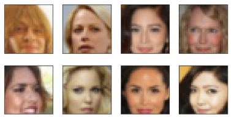

### Udacity Deep Learning Nanodegree Program + Own Projects

This folder contains all the projects from Udacity's Nanodegree Program along with own projects. All of them are 
stored in the 'project-XXX' format:

**Udacity**
- [x] [Bike-Sharing (pure numpy)](#bike-sharing)
- [x] [Landmark Classification (CNN, Transfer Learning, VGG16)](#landmark)
- [x] [TV Script Generator (RNN, LSTM)](#tv-script-generator) 
- [x] [Face Generator (GAN)](#face-generator) 
- [x] [Deploying Sentiment Analysis Model (AWS SageMaker, REST API, NLP)](#deploying-the-model)

**Own**
- [x] [102 Flowers (CNN, Transfer Learning, ResNet34, Discriminative Learning Rates)](#flower)
- [] Bike-Sharing (CNN, Regression) 
- [] Dog Classification (CNN, Transfer Learning) 
- [] Cancer Detection (CNN, Transfer Learning) 


## Bike-Sharing Rentals <a class="anchor" id="bike-sharing"/> <br>
* <a href="https://github.com/issagaliyeva/deep_learning_projects/blob/master/project-bike-sharing/Predicting_bike_sharing_data.ipynb">Numpy Implementation</a>
* <a href="https://github.com/issagaliyeva/deep_learning_projects/blob/master/project-bike-sharing/pytorch_implementation.ipynb">Pytorch Implementation</a> [under development]

<b>The first</b> case was implemented using a vanilla approach with pure numpy package. <br>
<b>The second one</b>, however, is my implementation to see how the results differ using PyTorch.  

<b>Project Description</b>
* hour.csv: bike sharing counts aggregated on hourly basis. Records: 17379 hours
* day.csv: bike sharing counts aggregated on daily basis. Records: 731 days

Bike sharing systems are new generation of traditional bike rentals where whole process from membership, rental and return 
has become automatic. Through these systems, user is able to easily rent a bike from a particular position and return 
back at another position. Currently, there are about over 500 bike-sharing programs around the world which is composed of 
over 500 thousands bicycles. Today, there exists great interest in these systems due to their important role in traffic, 
environmental and health issues.

---

## Landmark Classifier <a class="anchor" id="landmark"/>
* <a href="https://github.com/issagaliyeva/deep_learning_projects/blob/master/project-landmark-classifier/landmark.ipynb">VGG16 Model</a>
* <a>Other Models</a> [under development]

This project is subset of <a href='https://www.kaggle.com/google/google-landmarks-dataset'>Google Landmarks</a> dataset on Kaggle. The objective of this project was to build own and transfer architectures using Convolutional Neural Networks (CNN).

<b>Project Description</b>
* 5000 images (50 folders, 100 images in each)
* Datasets can be found here (BE CAREFUL, automatic download): [landmark dataset](https://udacity-dlnfd.s3-us-west-1.amazonaws.com/datasets/landmark_images.zip)

Photo sharing and photo storage services like to have location data for each photo that is uploaded. With the location data, these services can build advanced features, such as automatic suggestion of relevant tags or automatic photo organization, which help provide a compelling user experience. Although a photo's location can often be obtained by looking at the photo's metadata, many photos uploaded to these services will not have location metadata available. This can happen when, for example, the camera capturing the picture does not have GPS or if a photo's metadata is scrubbed due to privacy concerns.

If no location metadata for an image is available, one way to infer the location is to detect and classify a discernible landmark in the image. Given the large number of landmarks across the world and the immense volume of images that are uploaded to photo sharing services, using human judgement to classify these landmarks would not be feasible.

---

## TV Script Generator
* <a href="https://github.com/issagaliyeva/deep_learning_projects/blob/master/project-tv-script-generation/dlnd_tv_script_generation.ipynb">RNN & LSTM implementation</a><br>

<b>Project Description</b>
* Seinfeld_Scripts.txt: All 9 season scripts (3.41 MB)

Imagine you are working for a production company, and your job is to write a script for one of their shows. You could write it manually or let an algorithm do it for you! In this
project we are asked to use RNN along with LSTM generate a good model whose accuracy should be <= 3.5.  <br>

**Small results extract**
```
jerry: and the best thing i ever heard.

jerry:(to the phone) hello, hello.

jerry: hey, you don't know?

jerry: yeah!

george: what happened to you?

jerry: i was just trying to get the money.

jerry: oh, come on!(he takes the magazine on the table and starts walking into her room) : yeah.

george: i mean, i was just trying to get some sleep.

jerry: oh, come on. i don't think so.(to jerry) you know, i don't want to talk about it...

kramer: oh, yeah... i got the car.

george: i don't want to be here.
```


---
## Face Generator
* <a href="https://github.com/issagaliyeva/deep_learning_projects/blob/master/project-face-generation/dlnd_face_generation.ipynb">GAN on celebrity images</a>

<b>Project Description</b>
* <a href="http://mmlab.ie.cuhk.edu.hk/projects/CelebA.html">CelebFaces Attributes Dataset (CelebA)</a>: 200,000 images, 32x32x3 

In this project, you'll define and train a DCGAN on a dataset of faces. Your goal is to get a generator network to generate new images of faces that look as realistic as possible.
There are multiple problems with the dataset: low resolution with biased dataset (lack of race and gender diversity).


---
## Deploying the Model
* <a href="https://github.com/issagaliyeva/deep_learning_projects/blob/master/project-aws-deployment/SageMaker%20Project.ipynb">SageMaker + REST API (for app)</a><br>

<b>Project Description</b>
* <a href="http://ai.stanford.edu/~amaas/data/sentiment/">IMDb dataset</a>: 50,000 highly polar movie reviews <br>

In this project you will construct a recurrent neural network for the purpose of determining the sentiment of a movie review using the IMDB data set. You will create this model using Amazon's SageMaker service. In addition, you will deploy your model and construct a simple web app which will interact with the deployed model.


---

## 102 Flower Classifier <br>
<a href="https://www.robots.ox.ac.uk/~vgg/publications/papers/nilsback08.pdf">Official Paper</a>&emsp;<a href="https://www.robots.ox.ac.uk/~vgg/data/flowers/102/">Official Page</a>&emsp;<a href="https://s3.amazonaws.com/fast-ai-imageclas/oxford-102-flowers.tgz">Download Dataset</a>&emsp;<a href="https://gist.github.com/JosephKJ/94c7728ed1a8e0cd87fe6a029769cde1">Download Labels</a>
<br>

<b>Project Description</b>
* train.csv : 1020 flower images' paths and targets (10 instances per category)
* validation.csv: 1020 flower images' paths and targets (10 instances per category)  
* test.csv: 6149 flower images' paths and targets

Although the idea of Deep Learning was born almost 80 years ago, we are just given the opportunity to bring any 
sophisticated ideas to life. That is why we will be looking 
at the extensively researched case of classfying 
<a href="https://www.robots.ox.ac.uk/~vgg/publications/papers/nilsback08.pdf">102 categories of flowers</a>. 
Even though the task does not sound hard, the challenges arise in the similarity in both color and shape.

 <br>
To give an example of similarities, there are nine types of lilies (Giant White Arum, Fire, Water, Toad, Blackberry, 
Sword, Tiger, Peruvian, Canna) and two types of 
irises (Bearded and Yellow). Additional difficulties can be found with the non-conventional distribution of training 
(12.45%), validation (12.45%), and testing (75.1%) sets.
The project will be worked with <a href="https://arxiv.org/abs/1512.03385">ResNet34</a> pre-trained model (a residual 
network that was trained on ImageNet's images).
It is considerately smaller than most of the other models with only 20 million parameters. Thus, the training part 
will not take long even on CPU mode (from my findings, running 15 epochs takes around 40 minutes). 


### Results
The notebook contains experimentations with different model instantiations, in particular, various optimizers. 
There are three of them used: <a href="https://paperswithcode.com/method/sgd">Stochastic Gradient Descent</a> (<a href="https://arxiv.org/abs/1607.01981">Nesterov's Accelerated Gradients</a>), <a href="https://paperswithcode.com/method/adagrad">Adagrad</a> and <a href="https://paperswithcode.com/method/adam">Adam </a>. It's challenging to find the correct optimizers,  so I wanted to see the actual differences in prediction before settling with a specific one. In addition to these experimentations, fellowship.ai's requirement was to use Discriminative Learning Rates. Thus, all models were trained using that technique along with Exponential Learning Decay Scheduler to boost accuracy. 

The overall accuracy of each model is over 80%, with the best ones (SGD and Adam) scoring 87%. However, there is the fifth model that has more transformations, which had a 100%
confidence on classifying the never-seen-before image of a sunflower. 

### What I learnt
* os package <br>
I was manually transferring the images to satisfy DataLoader's and ImageFolder's requirements. Therefore, there was an extensive usage of such package. 
The main feature to remember: **DataLoader treats names as strings, even if the names are numeric**. PyCharm uses automatic folder sorting, so there might be
mismatch between PyCharm's and DataLoader's way of structuring things.   
* Discriminative Learning Rates  <br>
To better understand how Discriminative Learning Rates work, the following image might help (right). 
To implement this technique, we need to use smaller learning rates at convolutional layers and bigger ones in the fully-connected ones. Doing so boosted the performance. 
I specifically want to focus on the case of Adagrad. At the beginning, I've trained it using 
<a href="https://pytorch.org/docs/stable/generated/torch.optim.lr_scheduler.ExponentialLR.html#torch.optim.lr_scheduler.ExponentialLR">Exponential Learning Decay Scheduler</a>. 
By doing so, only **depressing** 23% of the images were correctly classified. However, by changing per-layer learning rates resulted in 61% performance improvement! 
 

---
